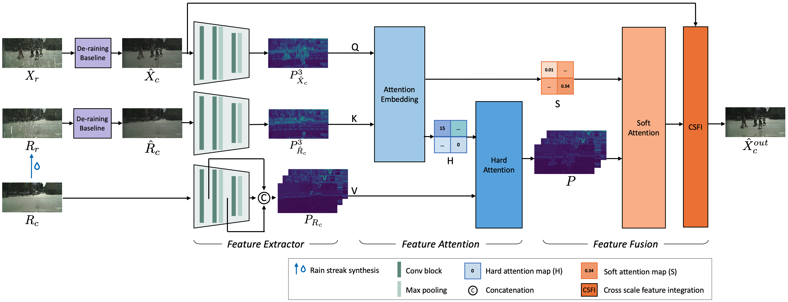

# Improving Image De-raining Using Reference-Guided Transformers

### Introduction
Image de-raining is a critical task in computer vision to improve visibility and enhance the robustness of outdoor vision systems. While recent advances in de-raining methods have achieved remarkable performance, the challenge remains to produce high-quality and visually pleasing de- rained results. In this paper, we present a reference-guided de-raining filter, a transformer network that enhances de- raining results using a reference clean image as guidance. We leverage the capabilities of the proposed module to further refine the images de-rained by existing methods. We validate our method on three datasets and show that our module can improve the performance of existing prior-based, CNN- based, and transformer-based approaches.

### Requirements
- Python 3.7
- PyTorch 1.12.1
- torchvision 0.13.1

install requirements package:
```
pip install -r requirement .txt
```

### Datasets
The datasets used in this project are derived from an original autonomous driving dataset. Clean images and their corresponding synthesized images, generated using SyRaGAN [2], are provided. You can download the datasets from the OneDrive link below. Once downloaded, please place the datasets in the `data/` directory.

- [BDD100K_Rain](https://1drv.ms/f/s!AhiCmYWu9pBria1EEB_5VzLPuYhfng?e=CdcCYz) [1]
- [Cityscapes_Rain](https://1drv.ms/f/s!AhiCmYWu9pBriv5_fRX1essBU6mdOw?e=0ZqoRM) [3]
- [KITTI_Rain](https://1drv.ms/f/s!AhiCmYWu9pBrifMLdsmGLt4UQMj-8g?e=ogzi0l) [3]

### Pre-Trained Model
- PreNet [4]
- Uformer[5]
### Testing
To test the model, run the following script with the specified options:
- `--standalone`: Use a single node.
- `--nproc_per_node=8`: Utilize 8 GPUs.
- `--baseline=PReNet`: Set the baseline model to PReNet [4]. Options: {PReNet [4], GMM, Uformer [5]}.
- `--baseline_module=baseline.model.PReNet.networks`: Specify the corresponding baseline model module.
- `--baseline_state_dir=${baseline_state_dir}`: Path to the baseline model.
- `--model_path=${model_path}`: Path to the RefGT model.

```
torchrun --standalone --nproc_per_node=8 \
		 main.py --baseline=PReNet --baseline_module=baseline.model.PReNet.networks \
		 --test=True --batch_size=8 \
		 --save_dir=test --baseline_state_dir=${baseline_state_dir} \
		 --dataset=BDD100K --model_path=${model_path}$
```


### Train
To train the model, run the following script with the specified options:
- `--standalone`: single node
- `--nproc_per_node=8`: 8 GPU
- `--baseline_state_dir=${baseline_state_dir}`: baseline model path

```
torchrun --standalone --nproc_per_node=8 \
		 main.py --baseline=PReNet --baseline_module=baseline.model.PReNet.networks \
		 --gt_init_epochs=10 --batch_size=8 \
		 --dataset=BDD100K  \
		 --baseline_state_dir=${baseline_state_dir}
```


### Reference
[1] F. Yu, H. Chen, X. Wang, W. Xian, Y. Chen, F. Liu, V. Madhavan, and T. Darrell, “Bdd100k: A diverse driv- ing dataset for heterogeneous multitask learning,” in Proceedings of the IEEE Conference on Computer Vi- sion and Pattern Recognition, 2020.

[2] J. Choi, D. H. Kim, S. Lee, S. H. Lee, and B. C. Song, “Synthesized rain images for deraining algo- rithms,” Neurocomputing, vol. 492, pp. 421–439, 2022.

[3] M. Tremblay, S. S. Halder, R. de Charette, and J. Lalonde, “Rain rendering for evaluating and improv- ing robustness to bad weather,” International Journal of Computer Vision, vol. 129, no. 2, pp. 341–360, 2021.

[4] D. Ren, W. Zuo, Q. Hu, P. Zhu, and D. Meng, “Pro- gressive image deraining networks: A better and simpler baseline,” in Proceedings of the IEEE/CVF Conference on Computer Vision and Pattern Recognition, 2019.

[5] Z. Wang, X. Cun, J. Bao, W. Zhou, J. Liu, and H. Li, “Uformer: A general u-shaped transformer for image restoration,” in Proceedings of the IEEE/CVF Con- ference on Computer Vision and Pattern Recognition, 2022.

### Citation
```
 @inproceedings{zihao2024derain,
   title={Improving Image de-raining Models using Reference-guided Transformers},
   author={Zihao Ye, Jaehoon Cho, and Changjae Oh},
   booktitle={IEEE International Conference on Image Processing},
   year={2024},
 }
```

